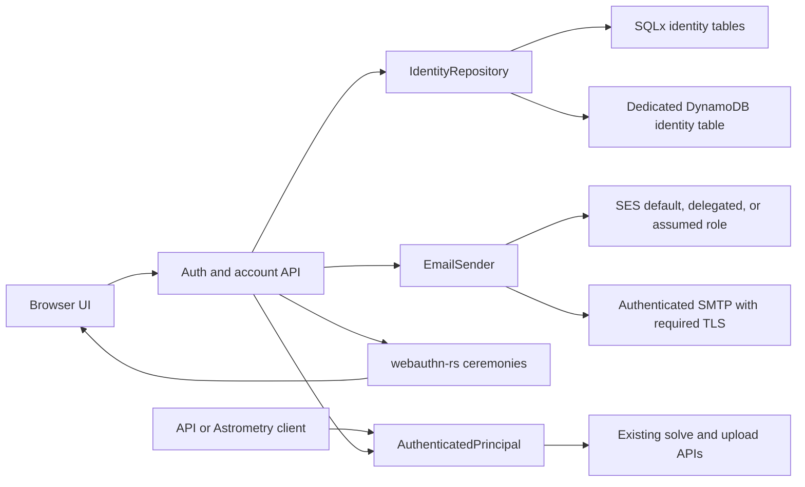

# Accounts, passkeys, API keys, and email authentication

Status: proposed implementation plan. None of the endpoints or configuration in
this document are available yet.

## Decision summary

Seiza Server should add an `accounts` authentication mode built around a
verified email address, passwordless email sign-in, passkeys, and account-owned
API keys.

- A user proves ownership of an email address with one message containing both
  a single-use link and a short code. That proof creates or signs in the
  account.
- After the first verified email sign-in, the UI strongly prompts the user to
  create a passkey. The prompt is skippable because email remains the recovery
  path, but it remains visible until at least one passkey exists.
- Returning users can sign in directly with a discoverable passkey without
  typing their email. Email link/code sign-in remains available when the
  passkey is unavailable.
- Browser sessions use a secure cookie. Programmatic clients use revocable,
  scoped API keys. The Astrometry.net-compatible login validates an account API
  key and returns an opaque session instead of the current unvalidated stub.
- Identity persistence is separate from the job repository behind an
  `IdentityRepository` trait. SQLx uses normalized tables in the configured
  SQLite/PostgreSQL database. DynamoDB uses a new dedicated identity table,
  not the jobs table.
- Email delivery is behind an `EmailSender` trait with Amazon SES API and
  authenticated SMTP implementations. SES supports the server account's normal
  credentials, delegated sending from an identity in another account, or
  assuming a role in a dedicated mail account.
- `public` and `stub-api-key` remain available during rollout. Operators opt in
  with `SEIZA_AUTH_MODE=accounts` only after the identity store, public URL,
  WebAuthn relying-party configuration, code pepper, and mail delivery are
  ready.

This design deliberately does not add passwords, social login, teams, billing,
or a general identity-provider service.



## Current state and constraints

The server currently has `public` and `stub-api-key` modes. Stub mode checks
only that a nonempty value exists; `/api/login` returns a random session that
is not persisted or validated. `SEIZA_PRIORITY_API_KEYS` is an operator-owned
comma-separated allowlist rather than an API-key store.

Jobs already persist an `owner` string and queue weight. This is the right seam
for authenticated fairness: account submissions should use
`account:<account-id>` as the owner so creating multiple API keys cannot create
multiple fair-queue identities. Result UUIDs remain unguessable capabilities in
the first account release. Account-scoped job history can follow later without
blocking authentication or requiring a new jobs-table index now.

The first implementation should keep the identity backend aligned with the
deployment's durability:

| Deployment | Identity persistence |
| --- | --- |
| Local SQLite | New SQLx tables in the identity SQL URL |
| PostgreSQL | New SQLx tables in the identity SQL URL |
| DynamoDB identity backend | New table from `SEIZA_IDENTITY_DYNAMODB_TABLE` |

Expose `SEIZA_IDENTITY_BACKEND=sqlx|dynamodb`, defaulting to
`SEIZA_JOB_BACKEND`, so a job-store migration does not silently move or abandon
accounts. Production should set both values explicitly. Do not overload the
DynamoDB job table: a dedicated identity table gives identity data narrower
IAM, backup, TTL, audit, and incident-response boundaries.

`SEIZA_IDENTITY_SQL_DATABASE_URL` defaults to `SEIZA_SQL_DATABASE_URL` so local
and PostgreSQL deployments can share one database while keeping separate
repository code. A deployment may point it at a separate database when identity
backup or access policy requires that boundary.

## User flows

### First sign-in and email verification

1. The user enters an email address on `/signin`.
2. `POST /api/v1/auth/email/start` validates and normalizes the address, applies
   per-IP and per-address rate limits, persists a challenge, and sends one
   message containing:
   - a 256-bit, single-use link token; and
   - an eight-digit, single-use code for another device or a mail client that
     does not open links.
3. The endpoint returns the same accepted response whether or not an account
   already exists. It must not reveal account membership.
4. The link opens a first-party page but does not consume the token on `GET`.
   After an explicit `Continue signing in` action, the page performs
   `POST /api/v1/auth/email/complete` and immediately removes the token from the
   visible URL/history. This avoids consuming links when a mail-security scanner
   prefetches them. Code entry uses the same endpoint with the normalized email,
   challenge ID, and code.
5. A successful completion atomically consumes the challenge, creates the
   account if necessary, records `email_verified_at`, and creates a browser
   session.
6. If the account has no passkeys, the response and UI route to passkey setup.
   The user can continue without one, but the account page retains a prominent
   setup prompt.

Email syntax validation is only an early error check. Receipt and successful
challenge completion are the ownership proof. Do not use DNS or MX lookup as a
substitute for ownership. Preserve the address as entered for display and
delivery; use a documented lookup form that trims whitespace, applies IDNA to
the domain, lowercases the domain, and case-folds the local part as Seiza's
account-identity policy.

Challenges expire after ten minutes, allow at most five incorrect code
attempts, and are single-use. Keep at most three live challenges for an address
so an attacker cannot invalidate a legitimate message merely by requesting a
new one; successful completion invalidates every other live challenge for that
address. Expiration is enforced in the application even when DynamoDB TTL
cleanup has not run yet.

### Passkey enrollment

Passkey registration requires a verified browser session and recent
authentication. The server creates and stores the registration ceremony state;
the browser invokes `navigator.credentials.create`; the server validates the
result before storing the credential.

Use the passkey flow from
[`webauthn-rs`](https://docs.rs/webauthn-rs/latest/webauthn_rs/) instead of
implementing WebAuthn verification. Registration policy should be:

- an explicit production RP ID, RP name, and exact HTTPS origin;
- a random, stable 64-byte WebAuthn user handle, never an email address or an
  email hash;
- discoverable credentials required, so email-free passkey sign-in works;
- user verification required;
- attestation preference `none` unless a future enterprise policy needs
  authenticator provenance; and
- synced and device-bound passkeys both accepted.

The W3C specification requires server-generated replay-resistant challenges,
challenge matching, RP ID scoping, and origin validation. It also warns against
putting personally identifying data in the user handle. See
[Web Authentication Level 3](https://www.w3.org/TR/webauthn-3/).

An account may register multiple passkeys and assign each a user-visible label.
The account UI shows creation and last-used times and supports revocation.
Removing the final passkey is allowed because verified email remains the
recovery path, but it requires recent reauthentication.

### Passkey sign-in

The sign-in page offers `Use a passkey` before the email form. Authentication
uses a discoverable-credential ceremony with an empty `allowCredentials` list,
then maps the random user handle and credential ID to the account. Conditional
mediation can enhance the email field when supported, but an explicit button is
the portable baseline.

The server must verify the stored ceremony, challenge, exact origin, RP ID,
signature, credential ID, account user handle, and user-verification flag. It
updates credential metadata and creates the same browser session used by email
sign-in. A suspicious signature-counter regression should be recorded as a
security signal rather than automatically locking an account, because synced
passkeys do not all provide a globally monotonic counter.

### Browser sessions and recovery

Browser sessions use a 256-bit random token in an
`__Host-seiza_session` cookie with `Secure`, `HttpOnly`, `Path=/`, and
`SameSite=Lax`. Store only a SHA-256 digest of the random token. Production
startup must reject an HTTP public base URL or an insecure-cookie setting;
localhost development may opt into an explicitly insecure, unprefixed
`seiza_session` cookie.

State-changing cookie-authenticated requests also require a session-bound CSRF
token in `X-CSRF-Token` and an allowed `Origin`. Account mode cannot retain the
current wildcard CORS policy for cookie-authenticated routes: browser sessions
are same-origin by default, and any allowed browser origins must be configured
exactly without combining credentials and a wildcard. API-key requests are not
cookie authenticated and do not require the CSRF token.

Sessions rotate after authentication, expire after 30 idle days and 90 absolute
days, and can be revoked individually or all at once. Sensitive actions—adding
or deleting passkeys, creating API keys, changing email in a later phase—require
authentication within the previous ten minutes. Email sign-in is always
available as recovery and re-verifies control of the account address.
Coalesce `last_seen_at` persistence to at most once per session every 15
minutes so normal browser traffic does not create a DynamoDB write per request.

## Persistence model

### Repository boundary

Add an `IdentityRepository` independent of `JobRepository`. It owns these
atomic invariants:

- one active account per normalized email;
- email challenge consumption and account/session creation are atomic;
- WebAuthn credential IDs and user handles are globally unique;
- API-key and session lookup returns no revoked or expired credential;
- passkey creation and its credential lookup record commit together; and
- challenge attempt counting and single-use consumption are conditional writes.

The service layer owns normalization, WebAuthn verification, token generation,
email rendering, HTTP cookies, rate limiting, and authorization decisions.
Repository implementations store opaque WebAuthn ceremony/credential JSON
produced by the selected library so the SQLx and DynamoDB paths share one
logical model.

### SQLx schema

Use explicit, versioned migrations rather than extending the current inline job
schema strings. Keep columns in the SQLite/PostgreSQL common subset and use
RFC 3339 UTC text timestamps as the existing repository does.

`accounts`

- `id TEXT PRIMARY KEY` (UUIDv4)
- `email TEXT NOT NULL`
- `email_lookup TEXT NOT NULL UNIQUE`
- `email_verified_at TEXT NOT NULL`
- `webauthn_user_handle TEXT NOT NULL UNIQUE`
- `status TEXT NOT NULL` (`active`, `disabled`)
- `created_at`, `updated_at`, `last_authenticated_at` as text timestamps

`auth_challenges`

- `id TEXT PRIMARY KEY`
- `purpose TEXT NOT NULL` (`email-login`, `passkey-registration`,
  `passkey-authentication`)
- nullable `account_id` and `email_lookup`
- nullable `link_token_digest`, `code_digest`, and `webauthn_state_json`
- `attempts BIGINT NOT NULL`, `created_at`, `expires_at`, `consumed_at`
- index on `(email_lookup, purpose, consumed_at)` for invalidation

`auth_sessions`

- `id TEXT PRIMARY KEY` (public lookup component, not the secret)
- `token_digest TEXT NOT NULL`
- `account_id TEXT NOT NULL`
- `kind TEXT NOT NULL` (`browser`, `astrometry`)
- `csrf_digest TEXT`, `created_at`, `last_seen_at`, `expires_at`,
  `absolute_expires_at`, `revoked_at`
- indexes on `account_id` and `expires_at`

`passkey_credentials`

- `id TEXT PRIMARY KEY` (server UUID used by management APIs)
- `credential_id TEXT NOT NULL UNIQUE` (authenticator value, base64url)
- `account_id TEXT NOT NULL`
- `credential_json TEXT NOT NULL`
- `label TEXT NOT NULL`, `created_at`, `last_used_at`, `revoked_at`
- index on `account_id`

`api_keys`

- `id TEXT PRIMARY KEY` (public lookup component)
- `account_id TEXT NOT NULL`
- `secret_digest TEXT NOT NULL`
- `display_prefix TEXT NOT NULL`, `name TEXT NOT NULL`
- `scopes_json TEXT NOT NULL`
- `queue_weight DOUBLE PRECISION NOT NULL DEFAULT 1.0`
- `created_at`, `expires_at`, `last_used_at`, `revoked_at`
- index on `account_id`

SQLx authentication parses the account and credential IDs from the presented
token, selects the session or API key through its primary-key index, and
verifies that its `account_id` matches. Authentication must never load all
credentials for an account and search them in application code.

Foreign keys should be enabled where both supported dialects can enforce them.
Repository logic must still behave correctly without relying solely on cascade
deletion because DynamoDB has no equivalent.

### DynamoDB schema

Create a dedicated on-demand table with string `pk` and `sk`, point-in-time
recovery, encryption, and TTL on `ttl_epoch`. This one identity table stores
accounts, sessions, and API keys; it does not require separate session or
API-key tables. Only records that need automatic cleanup populate `ttl_epoch`.
No GSI is required for the first release.

| `pk` | `sk` | Purpose |
| --- | --- | --- |
| `ACCOUNT#<uuid>` | `PROFILE` | Account and verified email |
| `EMAIL#<email-lookup>` | `ACCOUNT` | Unique email-to-account lookup |
| `EMAIL#<email-lookup>` | `CHALLENGES` | Up to three live email challenge IDs and rate state |
| `USER#<user-handle>` | `ACCOUNT` | Discoverable-passkey account lookup |
| `ACCOUNT#<uuid>` | `PASSKEY#<passkey-id>` | Passkey metadata and credential JSON |
| `CREDENTIAL#<credential-hash>` | `ACCOUNT` | Credential-to-account/passkey lookup |
| `ACCOUNT#<uuid>` | `APIKEY#<key-id>` | API-key authentication and management record |
| `ACCOUNT#<uuid>` | `SESSION#<session-id>` | Browser or Astrometry session record |
| `CHALLENGE#<challenge-id>` | `CHALLENGE` | Email or WebAuthn ceremony state |

The public portion of every session and API key contains its account UUID and
record ID. Authentication parses those locators and performs an exact
`GetItem` for `ACCOUNT#<uuid>` plus `SESSION#<session-id>` or
`APIKEY#<key-id>`. Account status is an additional exact profile read, which
may be combined with the credential read through `TransactGetItems` when a
consistent snapshot matters. Account management lists credentials with a
partition `Query` and an `sk` prefix. Authentication and validation paths must
never use `Scan` or search a queried item collection for a presented token.

Use `TransactWriteItems` for account plus email/user-handle aliases, passkey
plus credential lookup, and email challenge-set updates. Successful email
completion consumes the chosen challenge, invalidates the other live IDs, and
creates the account/session in one transaction. Conditional expressions
enforce uniqueness, attempt limits, unconsumed challenges, and revocation.

TTL is asynchronous storage cleanup only, never the source of authorization
truth. Sessions set `ttl_epoch` to the earlier of their current idle and
absolute expiration and refresh it with the coalesced `last_seen_at` write.
Challenges and optionally expiring API keys set it from their retention
deadline. Permanent account and passkey records omit it. Every read rejects an
expired or revoked record even if DynamoDB has not deleted it yet.

Email and user-handle lookup values are SHA-256/base64url digests so raw email
and user handles do not appear in DynamoDB partition-key metrics or IAM logs.
The account profile still stores the email because the service must display it
and send recovery messages.

Identity data is not part of the existing job-store migration snapshot. Add a
separate `migrate-identity-store` command before supporting backend changes on
an established accounts deployment. It must copy accounts, active passkeys,
API-key metadata/digests, and nonexpired sessions, rebuild lookup items, and
verify a logical snapshot before cutover. Expired challenges are not migrated.

## Credential and token formats

Use public composite locators plus a random secret so credential lookup is a
point read followed by a constant-time digest comparison:

- API key:
  `seiza_key_<account-id>_<key-id>_<32-byte-base64url-secret>`
- browser/Astrometry session:
  `seiza_session_<account-id>_<session-id>_<32-byte-base64url-secret>`
- email link token: `seiza_login_<challenge-id>_<32-byte-base64url-secret>`

Account, key, and session IDs are random, non-secret lookup components. Changing
one only selects a missing record or one whose secret digest does not match.
The complete bearer value remains sensitive and must never be logged.

Store SHA-256 digests for high-entropy random secrets. The eight-digit email
code has low entropy, so store `HMAC-SHA-256(code-pepper, challenge-id || code)`
and require `SEIZA_AUTH_CODE_PEPPER_FILE` from a shared secret store. Rotating
that pepper invalidates only outstanding ten-minute codes, not passkeys,
sessions, or API keys.

API-key secrets are displayed exactly once. Names, prefixes, creation time,
last use, scopes, and expiry remain visible. Initial scopes should be:

- `solve:submit` for native and TUS submissions;
- `solve:resolve` for re-solving retained inputs; and
- `account:read` only if a nonbrowser client needs account metadata later.

Update API-key and passkey `last_used_at` as best-effort metadata, coalesced to
at most once per credential per hour. Authentication success must not depend on
that bookkeeping write.

Reading an unguessable result URL remains capability-based in the first phase.
An account-created API key defaults to queue weight `1.0`; only an operator-side
tier/administration path may raise it. Client-supplied metadata must never set
queue weight. All keys for one account share the account owner ID for rate
limits and fair queueing.

## HTTP API plan

### Authentication

| Method and path | Purpose |
| --- | --- |
| `POST /api/v1/auth/email/start` | Send one link/code message; generic accepted response |
| `POST /api/v1/auth/email/complete` | Consume a link token or email/challenge/code tuple |
| `POST /api/v1/auth/passkeys/authentication/start` | Start discoverable passkey sign-in |
| `POST /api/v1/auth/passkeys/authentication/complete` | Verify assertion and create browser session |
| `POST /api/v1/auth/logout` | Revoke the current session and clear its cookie |
| `POST /api/v1/auth/logout-all` | Revoke all account sessions after recent auth |

`email/start` returns `202` with a challenge handle and resend timestamp. A mail
provider failure returns a generic retryable `503` for every address; account
existence must not affect the response. Link completion accepts a token only in
the POST body, not the URL after the landing page loads. Responses set the
cookie and return the CSRF token plus `passkey_setup_recommended`.

### Account and credentials

| Method and path | Purpose |
| --- | --- |
| `GET /api/v1/account` | Verified email, session summary, and setup state |
| `GET /api/v1/account/passkeys` | List labels and usage metadata |
| `POST /api/v1/account/passkeys/registration/start` | Start registration after recent auth |
| `POST /api/v1/account/passkeys/registration/complete` | Verify and persist a passkey |
| `DELETE /api/v1/account/passkeys/{passkey_id}` | Revoke a passkey after recent auth |
| `GET /api/v1/account/api-keys` | List key metadata, never secrets |
| `POST /api/v1/account/api-keys` | Create a named, scoped key and return its secret once |
| `DELETE /api/v1/account/api-keys/{key_id}` | Revoke a key immediately |

All mutating cookie-authenticated routes require the CSRF token. Responses use
`Cache-Control: no-store` and must not include email, session tokens, passkey
ceremony state, or API-key secrets in structured logs.

### Existing API integration

Add an `AuthenticatedPrincipal` extractor returning account ID, credential ID,
scopes, queue weight, and authentication time. Authentication order is:

1. account browser cookie for same-origin UI requests;
2. account API key from `X-API-Key` or `Authorization: Bearer`;
3. Astrometry session supplied in its existing request JSON; or
4. public/stub behavior only when the configured mode allows it.

The internal worker routes retain their separate `SEIZA_WORKER_TOKEN` contract;
they must never accept account API keys. In `accounts` mode, `/api/login`
validates the supplied account API key and creates a persisted
`kind=astrometry` session. Existing Astrometry clients then continue sending
that opaque session in `request-json`.

Submission persists `account:<uuid>` as owner and the server-controlled account
tier as queue weight. `SEIZA_PRIORITY_API_KEYS` remains only for legacy stub
mode and is deprecated once account keys are available. Public and historical
result URLs continue to work without login. Account job history and private
result ACLs are a later feature that would require owner-query support in both
job repositories and a DynamoDB index.

## Email delivery

### Adapter

Introduce:

```rust
#[async_trait]
trait EmailSender: Send + Sync {
    async fn send_sign_in(&self, message: SignInEmail) -> anyhow::Result<DeliveryId>;
}
```

`SignInEmail` contains a validated recipient, configured sender, subject,
plain-text body, HTML body, challenge ID, and nonsecret observability tags. Both
providers render the same templates. The service persists the challenge before
sending. A successful provider response completes `email/start`; a provider
failure leaves an unusable short-lived challenge, returns a generic `503`, and
lets a later rate-limited request try again. Do not add a durable mail outbox or
new queue until delivery metrics show that synchronous provider retry is
insufficient.

### Amazon SES API

Add `aws-sdk-sesv2` under the AWS feature and use `SendEmail`. Supported
credential paths, in preferred order, are:

1. **Normal task credentials.** Use the existing AWS default credential chain
   and a verified identity in the server's account.
2. **SES sending authorization.** The identity-owning account attaches a
   narrowly scoped sending-authorization policy for the server account or task
   role. The server still uses its normal credentials and supplies
   `FromEmailAddressIdentityArn`. This is the lowest-complexity cross-account
   option and lets the identity owner revoke delegation independently.
3. **Assume role.** If policy requires SES calls to originate from the mail
   account, configure an optional role ARN and external ID. Build the SES client
   with an STS assume-role credential provider. The server task role receives
   only `sts:AssumeRole` on that role; the mail-account role receives only the
   necessary SES send permissions and sender-address conditions. AWS documents
   the temporary-credential model in
   [Create a role to give permissions to an IAM user](https://docs.aws.amazon.com/IAM/latest/UserGuide/id_roles_create_for-user.html).

AWS documents both
[SES sending authorization](https://docs.aws.amazon.com/ses/latest/dg/sending-authorization.html)
and the
[`FromEmailAddressIdentityArn` request field](https://docs.aws.amazon.com/ses/latest/APIReference-V2/API_SendEmail.html).
Policy conditions should restrict the from address and permitted principal;
see the
[sending policy examples](https://docs.aws.amazon.com/ses/latest/dg/sending-authorization-policy-examples.html).

SES configuration supports a region, from address, optional identity ARN,
optional configuration set, optional role ARN, optional external ID, and
message tags. The sending identity must have DKIM/SPF alignment, the selected
region must have production access in the account whose SES quota the call
uses, and a configuration set must route delivery, bounce, and complaint
events. AWS requires senders to manage bounces and complaints; see
[SES event notifications](https://docs.aws.amazon.com/ses/latest/dg/monitor-sending-activity-using-notifications.html).
New SES accounts are sandboxed per region, so rollout also includes
[requesting production access](https://docs.aws.amazon.com/ses/latest/dg/request-production-access.html).

The first app release records provider delivery IDs and emits metrics. Infra
must alarm on bounces/complaints and can feed a later suppression hook. A hard
bounce must not mark an uncompleted account as verified.

### Authenticated SMTP

Add `lettre` with Tokio and Rustls behind an `email-smtp` feature. Support an
authenticated relay with:

- hostname and port;
- username and password, with password accepted from a mounted `*_FILE` secret;
- required STARTTLS (normally port 587) or required implicit TLS (normally port
  465); and
- configurable connect/send timeout and from address.

Do not support plaintext or opportunistic downgrade. `lettre` provides an
async authenticated SMTP relay and encrypted transports; see its
[SMTP transport documentation](https://docs.rs/lettre/latest/lettre/transport/smtp/index.html).
Amazon SES SMTP is also compatible, but its SMTP credentials are region-specific
and distinct from normal AWS access keys, as described by
[AWS's SMTP credential documentation](https://docs.aws.amazon.com/ses/latest/dg/smtp-credentials.html).

SMTP OAuth, direct-to-MX delivery, inbound email, and provider-specific template
APIs are out of scope for the first implementation.

## Configuration

Accounts mode should fail closed at startup when required values are missing or
inconsistent.

| Variable | Purpose |
| --- | --- |
| `SEIZA_AUTH_MODE=accounts` | Enable real account/session/API-key validation |
| `SEIZA_IDENTITY_BACKEND` | `sqlx` or `dynamodb`; defaults to job backend |
| `SEIZA_IDENTITY_SQL_DATABASE_URL` | Identity SQL URL; defaults to job SQL URL |
| `SEIZA_IDENTITY_DYNAMODB_TABLE` | Dedicated identity table name |
| `SEIZA_PUBLIC_BASE_URL` | Canonical HTTPS origin used in links and cookies |
| `SEIZA_AUTH_CODE_PEPPER_FILE` | Shared secret for short-code HMACs |
| `SEIZA_EMAIL_PROVIDER` | `ses` or `smtp` |
| `SEIZA_EMAIL_FROM` | Verified/enabled sender mailbox |
| `SEIZA_SES_FROM_IDENTITY_ARN` | Optional delegated sending identity ARN |
| `SEIZA_SES_ROLE_ARN` | Optional cross-account mail role |
| `SEIZA_SES_ROLE_EXTERNAL_ID_FILE` | Optional assume-role external ID |
| `SEIZA_SMTP_HOST`, `SEIZA_SMTP_PORT` | Authenticated relay endpoint |
| `SEIZA_SMTP_USERNAME` | Relay login |
| `SEIZA_SMTP_PASSWORD_FILE` | Mounted relay secret |
| `SEIZA_SMTP_TLS` | `starttls` or `implicit`; no plaintext value |
| `SEIZA_SMTP_TIMEOUT_SECONDS` | SMTP connection and request timeout |

SES uses the standard AWS region and credential configuration. The SES and
SMTP settings are mutually exclusive. Debug output redacts every
secret and credential. ECS/Kubernetes deployments should mount secret files or
use a secrets-injection mechanism rather than place credentials directly in a
checked-in environment file.

## Frontend plan

The React app provides `/signin` and `/account` routes and loads
`GET /api/v1/account` on startup. The browser session remains in an HttpOnly
cookie. A separate session-bound, readable same-site cookie supplies the CSRF
header after a reload; neither value is written to local storage.

The sign-in page presents:

1. `Use a passkey` as the primary action when WebAuthn is available;
2. an email field labeled as sign-in and account creation;
3. a code-entry state after email submission; and
4. a resend timer with generic delivery wording.

The first verified sign-in routes to passkey setup. Explain that the passkey is
the preferred fast sign-in and the verified email remains recovery. The account
page manages passkeys, API keys, and sessions. API-key creation requires a name,
shows the secret once, and requires explicit confirmation that it has been
copied before leaving.

TUS requests are same-origin and automatically carry the browser cookie. The
API client must attach the CSRF header to mutating cookie-authenticated JSON
requests. Cross-origin programmatic upload clients use API keys, never browser
cookies.

## Security and abuse controls

- Use separate token buckets for email start by source IP and normalized email,
  plus a global provider circuit breaker. These limits are independent of solve
  admission limits.
- Return generic email-start and completion errors that do not distinguish
  existing accounts. Pad or otherwise monitor large timing differences in
  account lookup paths.
- Never consume a login link on `GET`; never place a browser session or API key
  in a URL; add `Referrer-Policy: no-referrer` to auth pages.
- Hash high-entropy bearer secrets, HMAC low-entropy codes, compare in constant
  time, redact authorization/cookie headers, and never emit email bodies.
- Bind WebAuthn ceremonies to stored server state and exact origin/RP ID. Use
  random user handles with no email-derived content.
- Require recent auth for credential management and revoke credentials with
  conditional writes. Disabling an account invalidates every session and key.
- Keep browser session auth and worker bearer auth as separate extractors and
  route groups.
- Keep account mode on same-origin HTTPS. Replace wildcard credentialed CORS
  with exact configured origins.
- Record security audit events for email verification, passkey/key creation and
  revocation, session revocation, account disablement, rate limiting, suspicious
  WebAuthn counters, and provider failures. Do not record secrets.
- Add retention: consumed/expired challenges 24 hours, revoked sessions 30
  days, revoked key/passkey metadata according to the audit policy, accounts
  until explicit deletion policy exists.

## Delivery phases

### Phase 1: identity repository and configuration (implemented in this PR)

- Add logical account/session/challenge/passkey/API-key models and repository
  contract tests.
- Add SQLx migrations and the dedicated DynamoDB template with TTL/PITR.
- Add configuration validation, secret redaction, and fake email sender.
- Keep production behavior on `public`/`stub-api-key`.

### Phase 2: verified email sessions (implemented in this PR)

- Implement email start/complete, session cookies, CSRF, logout, rate limits,
  and generic anti-enumeration responses.
- Implement SES default/delegated/assume-role modes and authenticated SMTP.
- Add sign-in/code UI and test delivery templates in plain text and HTML.
- Enable `accounts` only in a nonproduction environment.

### Phase 3: passkeys (next validation boundary)

- Integrate `webauthn-rs`, ceremony persistence, registration, discoverable
  authentication, recent-auth enforcement, and credential management.
- Add the post-email passkey setup flow and explicit passkey-first sign-in.
- Add virtual-authenticator browser tests.

### Phase 4: API keys and compatibility

- Implement API-key lifecycle/scopes and `AuthenticatedPrincipal`.
- Attribute jobs and fairness to account IDs.
- Replace Astrometry stub sessions in accounts mode with persisted sessions.
- Retain public/stub modes and deprecate `SEIZA_PRIORITY_API_KEYS` only for
  accounts deployments.

### Phase 5: production rollout

- Provision identity storage, SES identity/policy or SMTP secret, sender
  authentication, event routing, alarms, and backup/restore tests.
- Deploy code with accounts mode disabled, run migrations, and exercise a
  canary account from email through passkey and API upload.
- Enable accounts mode, monitor delivery/auth failures and queue attribution,
  and keep a documented rollback to public/stub mode that does not delete
  identity data.

## Verification and acceptance criteria

Repository contract tests must run against SQLite and PostgreSQL, with DynamoDB
serialization/conditional-write tests and an AWS integration path. API tests
use a fake mail sender and deterministic clock. Browser tests use a local mail
capture endpoint and a Chromium virtual authenticator.

The feature is ready to enable only when all of these hold:

- an unknown and known email receive indistinguishable start responses;
- link scanners cannot consume a token with `GET`;
- a link/code is single-use, expires, and locks after the attempt limit;
- account creation, challenge consumption, and session creation cannot split
  across partial writes;
- a verified user is prompted for passkey setup and can skip/recover by email;
- discoverable passkey sign-in works without entering an email and rejects
  wrong origin, RP ID, challenge, signature, user handle, and missing user
  verification;
- API-key secrets are shown once, hashed at rest, scope-checked, immediately
  revocable, and all keys share account-level fairness;
- DynamoDB session and API-key authentication uses exact item reads from token
  locators, account management uses bounded partition queries, and no
  authentication path uses a table scan or GSI;
- DynamoDB TTL eventually removes expired session and challenge records while
  application reads reject them immediately after expiration;
- browser cookies are secure/HttpOnly/SameSite, CSRF is enforced, and accounts
  mode rejects wildcard credentialed CORS;
- `/api/login` rejects unknown keys in accounts mode and returns a persisted
  Astrometry session for a valid key;
- public and stub modes retain their existing compatibility;
- SES works with normal credentials and at least one cross-account method, and
  SMTP works with required TLS and authentication;
- bounce/complaint monitoring and production SES access are in place before
  relying on SES for user access; and
- identity backup, restore, migration, metrics, audit logs, and rollback have
  been exercised in staging.

## Deferred decisions

These should not block the first account release:

- account-scoped solve history and private result ACLs;
- email-address change and account merge;
- teams, service accounts, invitations, and delegated administration;
- OAuth/OIDC/social login and SMTP OAuth;
- billing plans or a user-editable priority tier;
- mandatory multiple passkeys; and
- automatic suppression-list ingestion beyond provider event monitoring.
