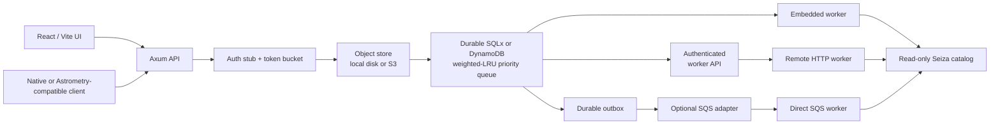

# Architecture

## Request lifecycle

The request path stops at enqueue. It does not invoke Seiza, build blind
indices, or hold the upload socket while detecting stars. That split is the
core behavior for a shared service: a client always receives a job ID quickly,
and workers are the only place expensive CPU/memory work can occur.

## Queue policy

Each entry has a client identity, a submission time, and a weight. At claim,
the scheduler selects the client with the greatest:

`time since the client was last served × client weight`

The default public and stub-key weights are both `1.0`, so this is
least-recently-served scheduling with FIFO ties. The weight exists for a future
API-key tier table rather than an opaque priority feature. A single client
cannot keep a backlog ahead of a client that has not recently received service.

The SQLx repository runs selection in a transaction (SQLite or PostgreSQL),
creates a random lease token, and updates `client_service.last_served_at` in
that transaction. The DynamoDB repository uses conditional item updates for
the same exclusive lease boundary. Workers must present that token to fetch
input, heartbeat, or complete. Expired leases return to `queued`; completion
updates only apply to the current token.

Admission is separate and uses a token bucket per client/IP. It returns HTTP
429 with `Retry-After` before the upload is persisted when the bucket is empty.

## Storage and durability

| Concern | Local baseline | AWS deployment | Horizontal production step |
| --- | --- | --- | --- |
| Original image | `SEIZA_DATA_DIR/objects` | S3 | Server sweep plus lifecycle defense-in-depth |
| Catalog | local readonly path | EFS or immutable image layer | Versioned catalog release |
| Job record | SQLx SQLite file | DynamoDB or SQLx PostgreSQL | DynamoDB or SQLx PostgreSQL |
| Scheduler | SQLx transaction | job store + SQS notification outbox | durable job store plus queue outbox |
| Worker | Tokio tasks or HTTP worker | ECS/EC2 HTTP or direct SQS worker | dedicated worker service |
| Authentication | public/stub | public/stub | API-key table, hash, revoke, tier/weight |

SQLite survives process restarts and supports multiple worker processes that
claim through one API process. It is intentionally a single-host durable queue:
do not place its database file on object storage or use it as a multi-AZ
database. SQLx also supports a PostgreSQL URL, and the DynamoDB repository is
a single table with a string `pk` partition key. For direct cloud delivery, the
durable outbox publishes only job IDs to SQS; the API remains the lease
authority and protects worker operations with a shared token. This makes
duplicate SQS messages and worker crashes safe.

Uploaded objects have a deliberately short lifecycle independent of job
durability. The API reports `input_expires_at`, denies preview/overlay access
after the configured retention window, and periodically deletes old objects
by filesystem modification time or S3 `LastModified`. The default is 24 hours
with an hourly sweep. Job rows, solution JSON, footprints, projected object
metadata, and downloadable WCS headers remain in the selected durable job
store. No schema-specific expiration process is required, so the same policy
works with SQLite, PostgreSQL, and DynamoDB. Production S3 buckets should also
use a matching lifecycle rule to cover interrupted cleanup processes.

Preview PNGs and annotated SVGs are generated on demand rather than stored as
additional durable objects. The SVG embeds its preview and marker geometry in
one response. Clients independently select catalog objects and a true
WCS-projected RA/Dec graticule through query parameters. Once the original
expires, visual artifacts return HTTP 410 while the standards-facing WCS
download remains available.

## API compatibility boundary

The native `/api/v1` API is the canonical service contract. The `/api/*`
endpoints mirror the useful polling path from Astrometry.net, including its
`request-json` form field and its calibration fields. This gives existing
clients a low-friction route without making Seiza's richer WCS result depend on
Astrometry.net's historic naming.

The compatibility API intentionally does not fetch `url_upload` sources. A
server-side URL fetch would need strict egress controls, DNS rebinding defenses,
size streaming, and an allowlist policy; client-side upload is the safe default.
