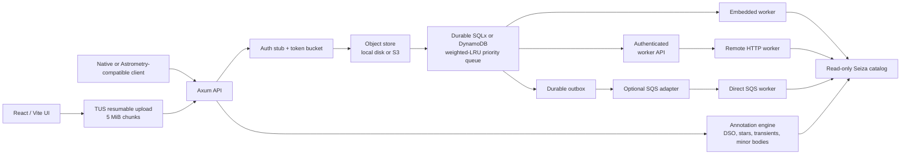

# Architecture

## Request lifecycle

The request path stops at enqueue. It does not invoke Seiza, build blind
indices, or hold the upload socket while detecting stars. That split is the
core behavior for a shared service: a client always receives an opaque public
solve ID quickly, and workers are the only place expensive CPU/memory work can
occur.

## Queue policy

Each entry has a client identity, a submission time, and a weight. At claim,
the scheduler selects the client with the greatest:

`time since the client was last served × client weight`

The default public and stub-key weights are both `1.0`, so this is
least-recently-served scheduling with FIFO ties. The weight exists for a future
API-key tier table rather than an opaque priority feature. A single client
cannot keep a backlog ahead of a client that has not recently received service.

The SQLx repository runs selection in a transaction (SQLite or PostgreSQL),
creates a random lease token, and updates `client_service.last_served_at` in
that transaction. The DynamoDB repository uses conditional item updates for
the same exclusive lease boundary. Workers must present that token to fetch
input, heartbeat, or complete. Expired leases return to `queued`; completion
updates only apply to the current token.

Admission is separate and uses a token bucket per client/IP. It returns HTTP
429 with `Retry-After` before the upload is persisted when the bucket is empty.

## Storage and durability

| Concern | Local baseline | AWS deployment | Horizontal production step |
| --- | --- | --- | --- |
| Original image | `SEIZA_DATA_DIR/objects` | S3 | Server sweep plus lifecycle defense-in-depth |
| Contributed validation image | protected object namespace | S3 prefix outside temporary lifecycle | explicit image grant plus durable contribution metadata |
| In-progress upload | object-store manifest + chunks | S3 manifest + chunks | Shared object store; resumable across API restarts |
| Catalog | local readonly path | EFS or immutable image layer | Versioned catalog release |
| Job record | SQLx SQLite file | DynamoDB or SQLx PostgreSQL | DynamoDB or SQLx PostgreSQL |
| Scheduler | SQLx transaction | job store + SQS notification outbox | durable job store plus queue outbox |
| Worker | Tokio tasks or HTTP worker | ECS/EC2 HTTP or direct SQS worker | dedicated worker service |
| Authentication | public/stub | public/stub | API-key table, hash, revoke, tier/weight |

SQLite survives process restarts and supports multiple worker processes that
claim through one API process. It is intentionally a single-host durable queue:
do not place its database file on object storage or use it as a multi-AZ
database. SQLx also supports a PostgreSQL URL, and the DynamoDB repository is
a single table with a string `pk` partition key. For direct cloud delivery, the
durable outbox publishes only job IDs to SQS; the API remains the lease
authority and protects worker operations with a shared token. Each job has one
random UUIDv4 used by the repository, public result URL, worker API, upload
object path, and SQS message, so neither backend needs a centralized sequence
generator. This makes duplicate SQS messages and worker crashes safe.

The AWS-enabled `migrate-store` command copies the complete logical job-store
snapshot between SQLx and DynamoDB while the service is quiesced. It preserves
job UUIDs, legacy and Astrometry.net aliases, fairness state, leases, attempts,
results, and outbox delivery timestamps. It includes validation-contribution
metadata, rebuilds DynamoDB object and compatibility indexes, converts old
numeric records using the UUID already present in their upload object keys, and
verifies the destination snapshot before a deployment changes backends.
Contribution metadata includes the invalid-solve classification; uploaded image
objects remain a separate object-store migration concern.

Uploaded objects have a deliberately short lifecycle independent of job
durability. The API reports `input_expires_at`, denies preview/overlay access
after the configured retention window, and periodically deletes old objects
by filesystem modification time or S3 `LastModified`. The default is 24 hours
with an hourly sweep. Job rows, calibration JSON, capture time, footprints,
and downloadable WCS headers remain in the selected durable job store.
Catalog annotations are regenerated from that WCS, so catalog upgrades do not
require a new solve. No schema-specific expiration process is required, so the
same policy works with SQLite, PostgreSQL, and DynamoDB. Production S3 buckets
should also use a matching lifecycle rule to cover interrupted cleanup.

Ordinary image submission does not transfer ownership and does not opt the
image into long-term storage. Once a job reaches `succeeded` or `failed`, its
opaque result page can submit an optional comment plus an affirmative,
versioned image grant. The object-store abstraction copies the original into
`SEIZA_VALIDATION_PREFIX`; local and S3 cleanup both exclude that namespace.
SQLx records the durable object key, comment, invalid-solve flag, grant
version, and acceptance time in `validation_donations`; DynamoDB stores the
same fields on the job item. Subsequent preview and retry reads prefer the
durable copy, while the temporary original remains eligible for normal
cleanup. S3 deployments should keep the validation prefix outside the
temporary-upload lifecycle rule.

The browser uses Uppy’s TUS client with 5 MiB chunks and retry delays. Files of
at least 10 MiB are split into three concurrent TUS partial uploads and joined
with the concatenation extension; smaller files remain sequential. A random
upload-session URL identifies each manifest stored beside its chunks in the
selected object store. `HEAD` returns the durable byte offset, so a client can
resume after a browser, network, or API-process interruption. Finalization is
idempotent: the jobs table enforces one row per private object key, and a lost
completion response reuses that row rather than queueing the image twice.
Partial sessions follow the same retention sweep as completed originals.

A failed job can transition back to `queued` with replacement solve options
while its input is still retained. The job ID, opaque public URL, object key,
owner, queue weight, and original expiration do not change. SQLx performs the
state change and durable-outbox reset in one transaction; DynamoDB uses a
conditional failed-state update and clears its delivery marker. External queue
notifications therefore behave the same as first submissions.

Preview PNGs are generated on demand rather than stored as additional durable
objects. The web client renders the preview as the base image and places a
responsive React SVG over it, independently toggling catalog categories and a
true WCS-projected RA/Dec graticule. PNG export fetches a full-resolution base
image and rasterizes the currently selected React overlay into one browser-side
PNG, then adds the Seiza logo and `seiza.fyi` attribution plaque; users never
need to download an SVG. The optional composite SVG API is generated on demand
for machine clients. Once the original expires,
image-backed visual artifacts return HTTP 410 while annotation JSON and the
standards-facing WCS download remain available.

## Calibration and annotation boundary

Workers persist only solve calibration: dimensions, WCS, footprint, matched
stars, and RMS. They do not need object, transient, or minor-body catalogs.
The API-side annotation engine projects those catalogs through the durable WCS
when a solution or `/annotations` endpoint is read. Deep-sky and transient
catalog files are checked for replacement and reloaded without a server
restart. Minor bodies are propagated to the capture time; FITS `DATE-OBS` is
captured during submission and non-FITS clients can provide it explicitly.

The optional `SEIZASI1` stellar-identifier sidecar is likewise memory-mapped
and hot-reloaded. At open time the server chooses one preferred human-facing
designation per stable stellar ID and builds a small sky-bin index. Annotation
requests project only the matching bins through the WCS, while
`/api/v1/catalog/stars/search` retains exact TYC/HIP and indexed textual lookup.

Seiza 0.5.0 object catalogs are read-only memory maps with embedded spatial and
designation indices. Overlay projection and `/api/v1/catalog/objects` cone
queries therefore materialize only matching records, while
`/api/v1/catalog/objects/search` uses the exact/prefix name index. Legacy v1
catalogs remain compatible but are decoded eagerly and do not carry stable IDs,
aliases, hierarchy, or source provenance. Blind-index startup likewise defers
the exhaustive validation pass, keeping API and worker startup independent of
the full catalog size.

This boundary keeps HTTP and cloud-queue workers interchangeable while catalog
updates immediately improve old solution pages. Named stars come from the
object catalog; the independent Star identifiers layer adds proper,
Bayer/Flamsteed, variable, and double-star labels from the Tycho sidecar; and
an optional field-star layer projects the solve tile catalog with a magnitude
threshold and result cap.

Native result URLs use the job's random UUIDv4 capability, indexed directly by
both repositories. The same UUID identifies the job to internal workers and
queue transports, so DynamoDB and distributed submitters need no shared counter.
Queue ordering comes from timestamps and weighted least-recently-used client
state, never from the UUID. The Astrometry.net compatibility API retains a
numeric alias because that protocol specifies numbers; it is not an ordering
sequence. Migration preserves old numeric aliases and continues to resolve
legacy `<sequence>-<UUID>` result URLs.

## API compatibility boundary

The native `/api/v1` API is the canonical service contract. The `/api/*`
endpoints mirror the useful polling path from Astrometry.net, including its
`request-json` form field and its calibration fields. This gives existing
clients a low-friction route without making Seiza's richer WCS result depend on
Astrometry.net's historic naming.

The compatibility API intentionally does not fetch `url_upload` sources. A
server-side URL fetch would need strict egress controls, DNS rebinding defenses,
size streaming, and an allowlist policy; client-side upload is the safe default.
